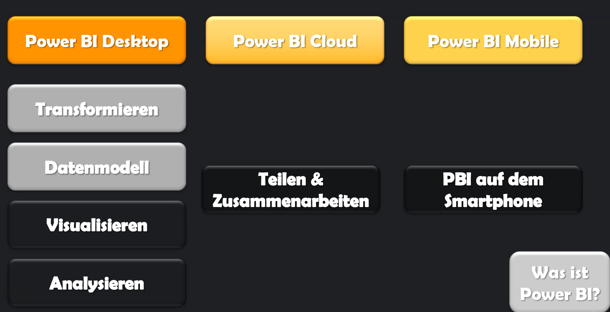
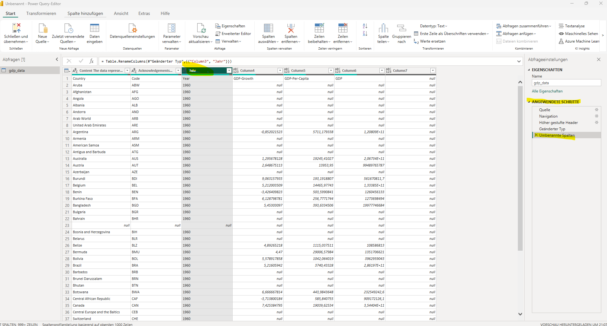
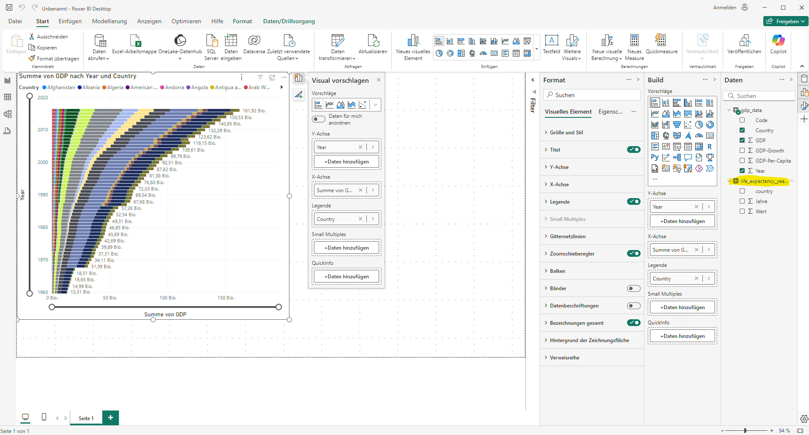
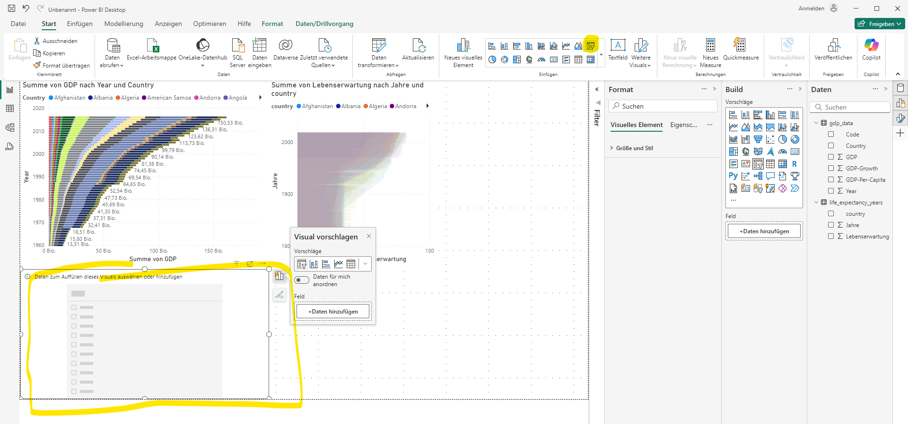
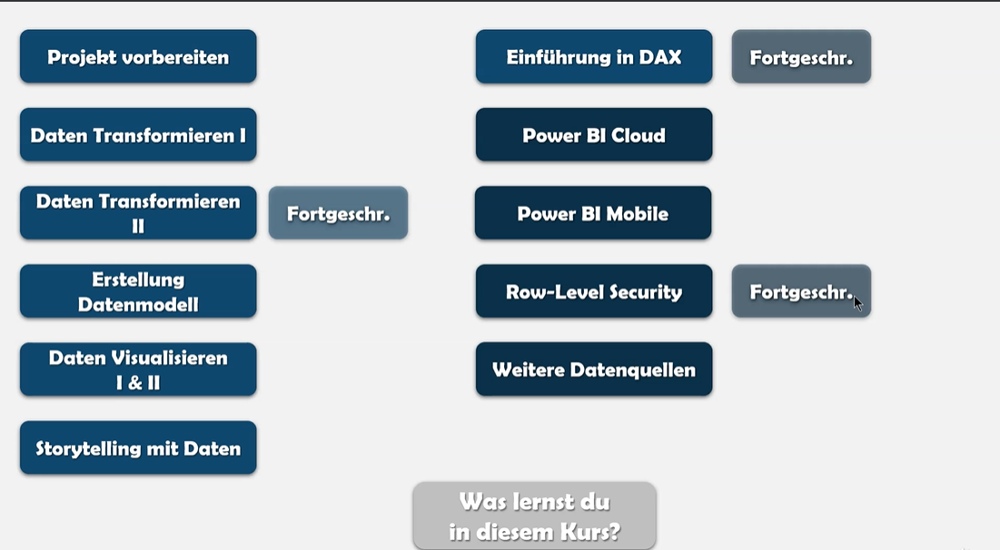

# PowerBI Desktop and Cloud

## Was ist PowerBI

- Datenvisualisierungstool (Visualisierung und Analyse)
- Vor der Visualisierung müssen Daten transformiert werden und ein Datenmodell muss erstellt werden

## PowerBI UI

Grundlegende Einstellungen:

Datei>Optionen und Einstellungen>Optionen:
Es können Einstellungen Global oder auch nur für die einzelnen Datein vorgenommen werden

## PowerBI mit Datenquelle verbinden

- Unter Berichtsansicht auf "Daten abrufen"
- Excel Datei auswählen (Übersicht über Spalten und Daten, Nullwerte ect)
- Vor dem Laden bei unsauberen Daten erst "Daten transformieren" / offnet PowerQuerry Editor
- Im Bereich angewendete Schritte können Datentransformierungsschritte Rückgängig gemacht werden bzw. man kann die einzelnen Tranformationsschritte gut nachvollziehen

- Im Menüband kann man z.B. "Zeilen entfernen", "Erste Zeile als Überschrift verwenden", "Leere Zeilen entfernen"
- Datentypen der einzelnen Spalten kann verändert werden durch klick auf Symbol in der Spaltenüberschrift
- Unter Tab "Transformieren" im Menüband gibt es die Einstellung "Datentyp" erkennen

## Mehrer Datenquellen miteinander verbinden

- Eine zweite Excel-Datei wird wie auch bei der ersten DAtei Importiert und erscheint Recht im Bereich "Daten"

- Zweite Grafik erstellen und zum Filtern einen "Datenschnitt" erstellen

- Spalten der beiden Datenquellen müssen in Modellansicht verbunden werden, damit Datenschnitt Element auch für alle Daten filtern kann

## Was wird alles in dem Kurs behandelt

