# Daten Transformieren

## Daten verbinden

- Klicken auf "Get data" und dann Files, Datenbanken oder andere Datenquellen auswählen.

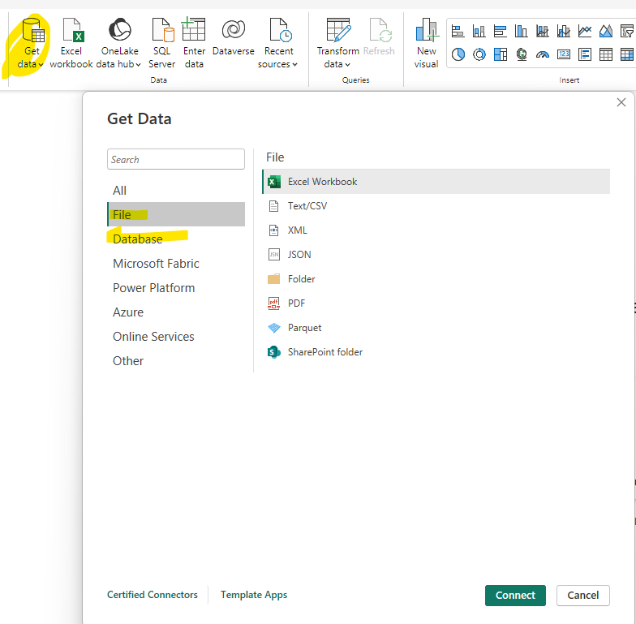

- Gewünschtes Excel File bzw. Mappe auswählen und im Navigator auf "Transform Data" klicken.

### Zeilen bearbeiten

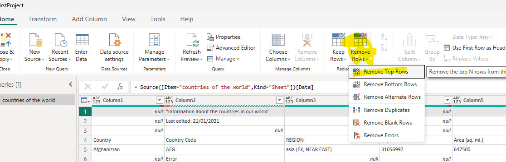

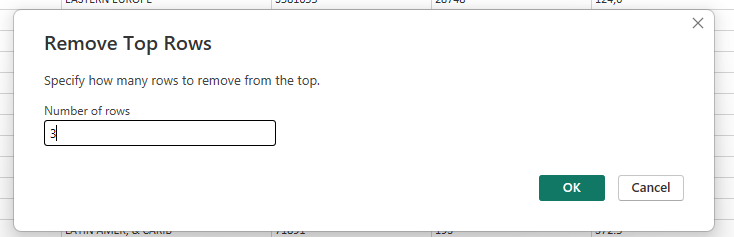

### Tabellenüberschriften auswählen

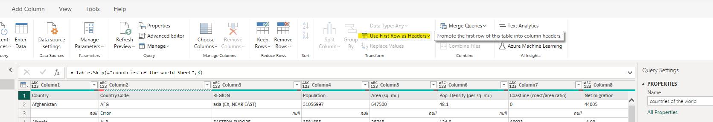

### Leere Zeilen / Fehler entfernen

- Fehler werden mit einem roten Symbol am Kopf der Spalte angezeigt.
- Spalte auswählen und auf "Remove Errors" klicken.

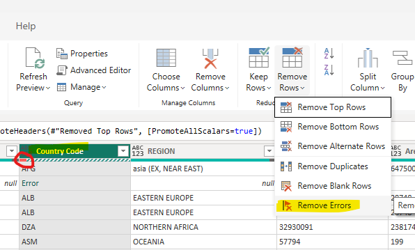

### Duplikate entfernen

- Spalte auswählen in der Duplikate entfernt werden sollen
- Remove Rows auswählen und Remove Duplicates auswählen

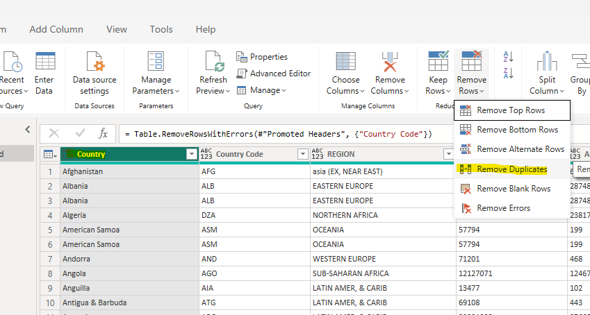

### Datentypen der Spalten

- Datentypen anzeigen indem man auf Symbol neben dem Spaltennamen klickt
- Auch Mehrfachauswahl der einzelnen Spalten notwendig

### Werte ersetzen in Spalten

- z.B. bei Dezimalzahlen die mit entweder mit "." oder mit "," getrennt werden
- um Daten korrekt zu verarbeiten müssen Punkte mit Komma ersetzt werden

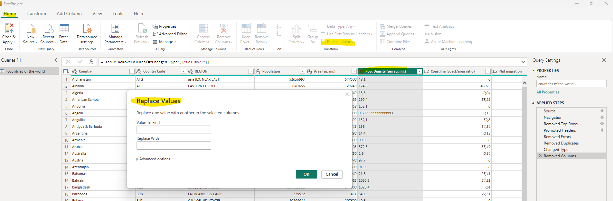

### Daten extrahieren

- Dazu wird eine weitere zusätzliche Datenquelle angebunden (.csv Datei)
- Import und Tranformation kann genau so gemacht werden wie bei Excel (beim Laden muss jedoch der Seperator ausgewählt werden)

Link für Datenabruf aus dem Internet: [Liste der Länder und Territorien nach Fläche](https://de.wikipedia.org/wiki/Liste_der_L%C3%A4nder_und_Territorien_nach_Fl%C3%A4che)
Url in zweites Fenster eintragen

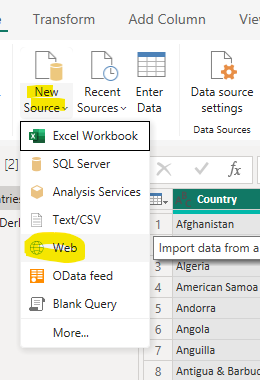

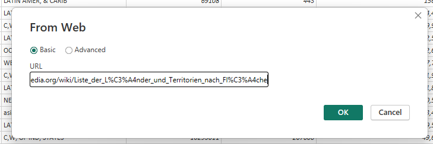

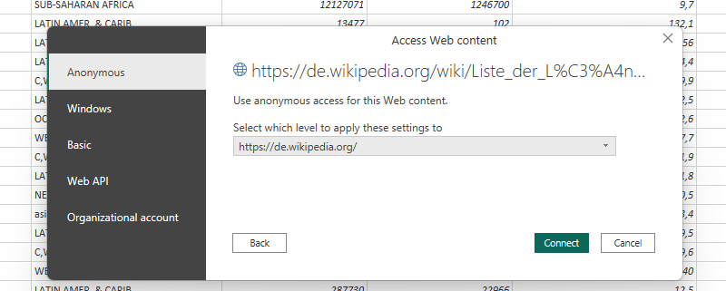

Power Bi parsed automatisch die Webseite und gibt Datenquellen zurück, diese können ausgewählt werden

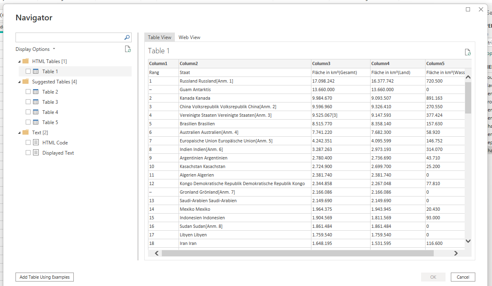

Um die Spalte "Staat" bzw. die Kürzel am Ende jeder Zeile zu extrahieren auf "Extract"-> "Text after Delimiter" klicken

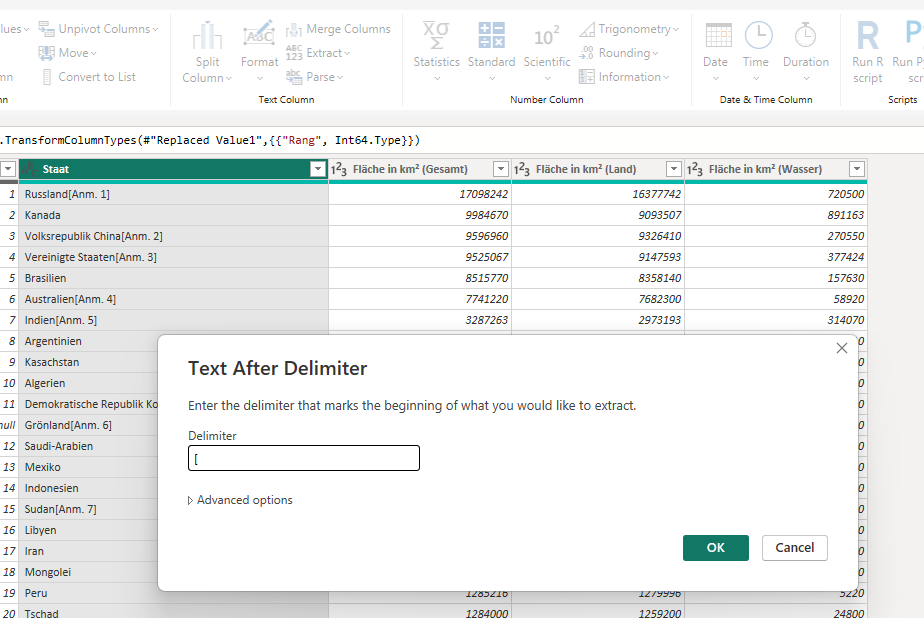

### Daten in neue Spalte verschieben

Spalte auswählen -> Split Column -> "By Delimiter" auswählen

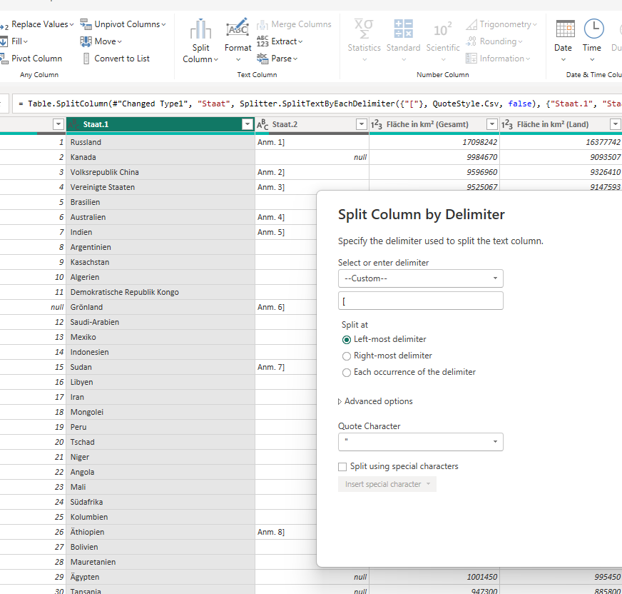

### Spalten hinzufügen

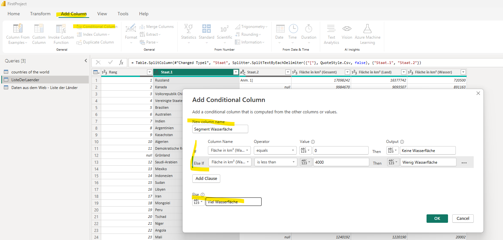

### Neue Spalten aus Beispielen erstellen

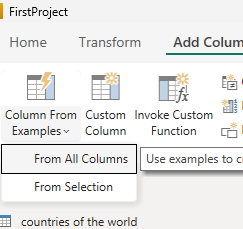

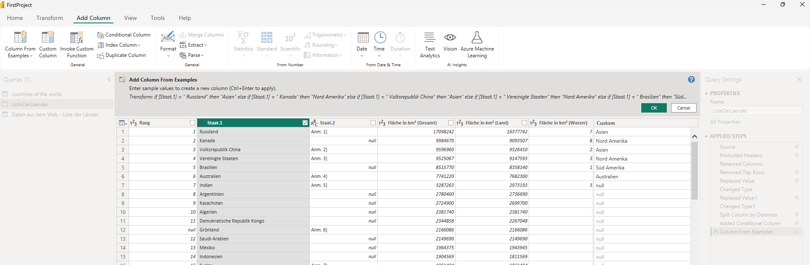

### Zusammenführen von mehreren Arbeitsmappen mit gleichen / ähnlichen Daten

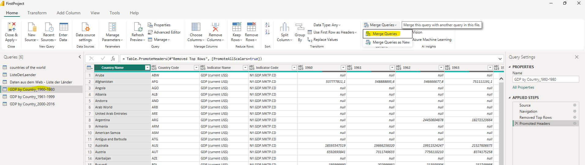

- Beide Tabellen werden anschließend gejoined
- Spalte über die gejoind werden soll muss jeweils angeklickt werden

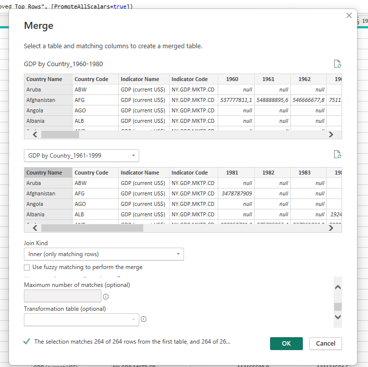

- Für den Join können durch halten der Shift Taste auch mehrere Spalten ausgewählt werden
- Nach dem Merge können die Daten angezeigt werden indem man auf das kleine Symbol der gejointen Tabelle klickt und die Daten filtert die man anzeigen möchte

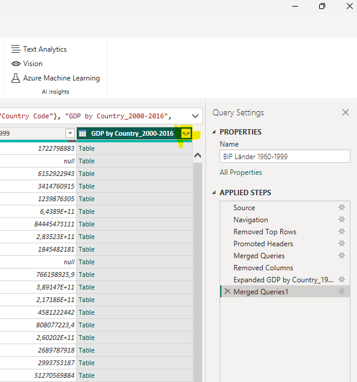
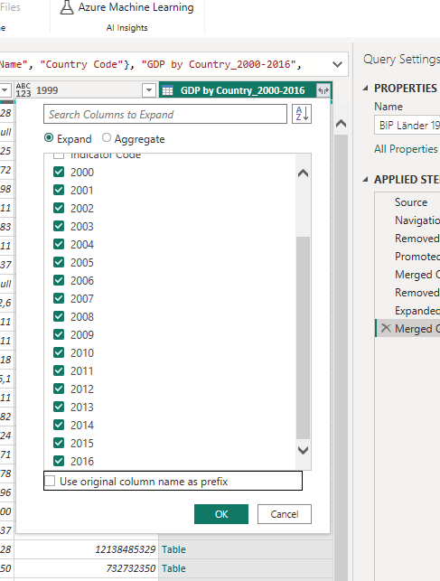

### Pivotisieren / Entpivotisieren

- Damit PowerBI Daten besser verarbeiten kann müssen die Daten manchmal besser vorbereitet werden
- Um Spalten zu Entpivotisieren alle Spalten markieren und "Unpivot Columns" auswählen

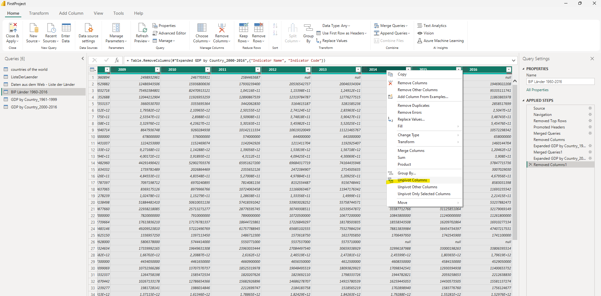

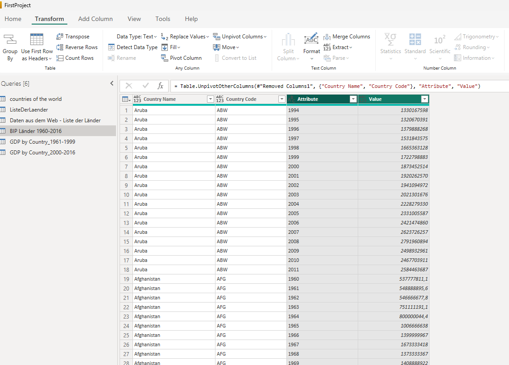

### Abfragen hinzufügen

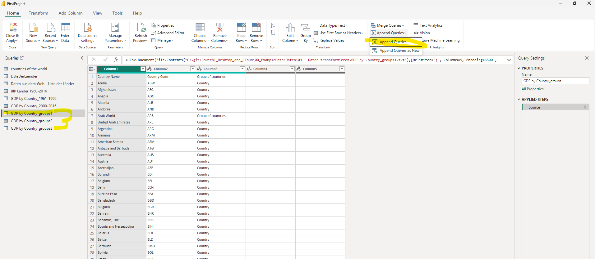

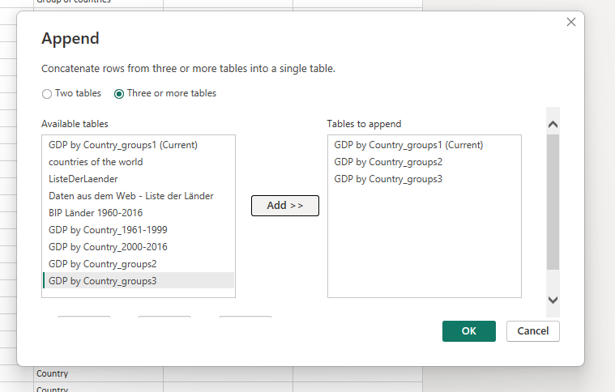

