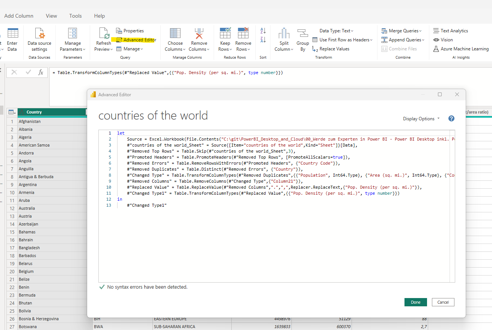

# Daten transformieren - fortgeschritten

## Erweiterter Editor

- Im erweiterten Editor kann der Code, der generiert wird für die verschiedenen Abfragen, bearbeitet werden

## Unterschied Verweis / Duplizieren

- Eine neue Tabelle die mit "Verweis"/"Reference" erzeugt wurde übernimmt automatisch auch alle Änderungen der Ausgangstabelle
- Ein Duplikat wird zum Zeitpunk x von einer Ausgangstabelle erzeugt und ist danach völlig unabhängig davon

- Die Beziehungen der einzelnen Tabellen zueinander können unter View->Querry Dependencies überprüft werden

## Laden aktivieren / deaktivieren

- Aus Performance-Gründen können nicht benötigte Hilfstabellen deaktiviert werden und verbessern so die Performance des Berichts da PowerBI diese nicht extra in das Datenmodell laden muss
- Zusätzlich kann, bei Tabellen die sich nicht ändern, die Einstellung "Include in report refresh" deaktiviert werden
- Dadurch werden die Ladezeiten bei Berichtsaktualisierungen verbessert

## Gruppierungen erstellen

- Unter "Transform->Group by" können die Daten gruppiert werden

- Es gibt aber auch die Möglichkeit mehrer Gruppierungen zu erstellen, dazu auf "Advanced" klicken

## Mathematische Operationen

- Math. Operationen sind nur bei Spalten mit einem Zahlenwert möglich
- Dafür einfach Spalte auswählen und im Menüband die gewünschte mathematische Operation auswählen

## R-Scripte in PowerBI ausführen

- Dies dient zur Erstellung von komplexen Berechnungen innerhalb von PowerBI

## Parameter zur dynamischen Transformierung

- Um einen Parameter zu erstellen unter Home->Manage Parameters auf New Parameter oder Manage Parameter klicken

## M-Formelsprache

- Die Formelsprache kann in dem erweiterten Editor aufgerufen werden

