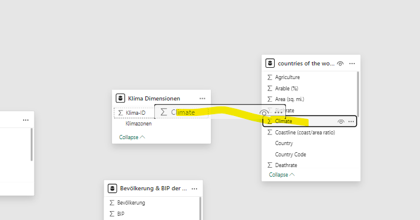

# Datenmodelle

## Datenmodell erstellen

- Das Datenmodell dient dazu, die Dimensionstabellen mit der Faktentabelle zu verknüpfen (Sternenschema)
- Es kann dafür genutz werden alle Beziehungen zwischen den Tabellen zu konfigurieren (so wie es auf Datenbanken auch gemacht wird bzw. diese Beziehungen nachbauen)
- Um das Datenmodell zu erstellen links in dem Menü auf "Model view" klicken

- Nicht benötigte Tabellen können für den Enduser bzw. die Berichtsansicht unsichtbar gemacht werden indem diese "unsichtbar" gemacht werden

- Um beziehungen (Foreign Key / Primary Key) festzulegen einfach die Spalten per Drag and Drop auf die anderen Tabellen ziehen

## Many-to-One Relationship

- Um die Beziehungen der Tabellen zu bearbeiten einfach auf den Pfeil im "Model View" klicken und die Beziehungen über das Dialog fenster einstellen

## One-to-One Relationship

- Es gibt nur je einen Wert die zueinanderpassen bzw. vorkommt

