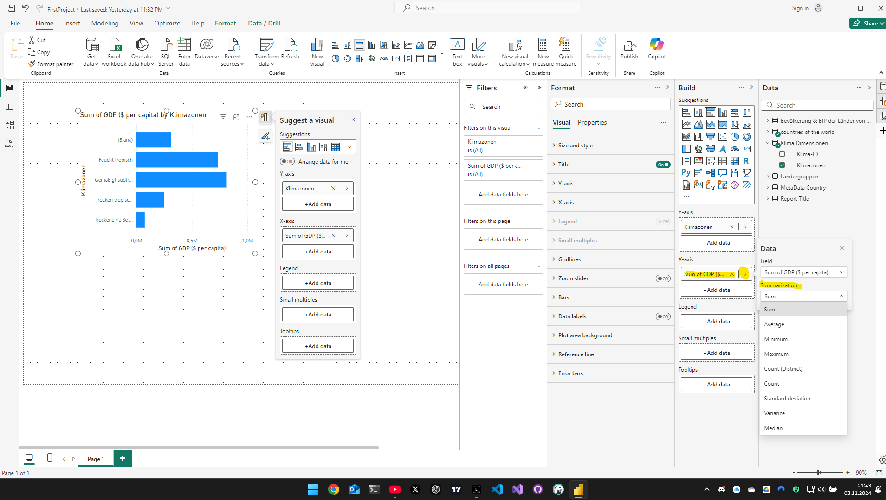

# Daten Visualisierung 1

## Visuals

- Alle vorhandenen Visuals befinden sich unter Home->Insert
- Nach Auswahl der Grafik können die benötigten Daten per Drag and Drop an die jeweiligen Stellen der Grafik gezogen werden

- Es kann auch ein Visual-Typ geändert werden, wenn man einfach ein anderen Diagrammtyp auswählt

## Visuals formatieren

- Datenaggregationen können bei den Einstellungen der Visuals konfiguriert werden

- Alle Formateinstellungen für die einzelnen Visuals sind in der Spalte "Format" zu treffen

- Eine Schnellauswahl ist direkt bei dem Visual verfügbar

- Über das "Help"-Icon können dem User nützliche Informationen zu den jeweiligen Visual gegeben werden

- Über "Smart narrative" wird eine automatisch generierte Datenerklärung hinzugefügt

## Reference line / Verweisreihe

- Diese Elemente können verwendet werden um Zielwerte in einer Grafik manuell oder dynamisch anzeigen zu lassen

## Fehlerbalken / Error Bars

## Liniendiagramm

- Diagramm auswählen und gewünschte Werte darstellen indem man diese per Drag and Drop in die x oder y Achse zieht
- es gibt die Möglichkeit eine zweite Y-Achse zu erstellen mit eigener Skalierung
- Wird eine sekundäre Y-Achse verwendet kann die Legende nicht mehr verwendet werden.

- Mit den "Small multiples" können sogar Grafiken aufgeteilt werden bzw. gruppiert werden

- Über den Reiter Format können die Werte eingestellt werden (Start erst ab Jahr 2000 als Minimum)

- Damit alle Grafiken in das Widget passen kann das Layout für "Small multiplies" angepasst werden

## Tabellen

## Bedingte Formatierung

- Bedingte Formatierungen können, abhängig von den einzelnen Visuals an verschiedenen Orten in der Formatspalte "versteckt" sein
- Für ein Balkendiagramm z.B. ist dies unter "Balken" zu finden

## Kreisdiagramme

- Kreisdiagramme eignen sich nicht immer gut um gewisse Datenzusammenhänge darzustellen
- Bestenfalls nur verwenden wenn alle Werte zusammen 100% ergeben

## Querfiltern & Interaktionen bearbeiten

## Interaktive Filter / Datenschnitte

## Drilldown

- Damit können Datenhirarchien innheralb der Daten dargestellt werden
- Mehrere Daten zu einem Visual hinzufügen und dann das Steuerelement mit dem Pfeil nach unten anklicken

- Dadurch werden alle Länder in der Grafik angezeigt, die in der Klimazone "Feucht Tropisch" liegen

## Drillthroughs

- Werden genutzt um von einem Visual zu einem anderen Visual auf einer anderen Seite bzw. in eine Detailansicht zu springen
- Detailansicht als neue Seite erstellen

- Rechtsklick auf das Visual und Drillthrough auswählen

- Alle Drillthrough Einstellungen können mit Rechtsklick auf die leere Seite -> Format canvas -> Page information gefunden werden

## Seitendesign bearbeiten/erstellen

- Es können fertige Designs heruntergeladen bzw. bearbeitet werden

## Treemap Visual

