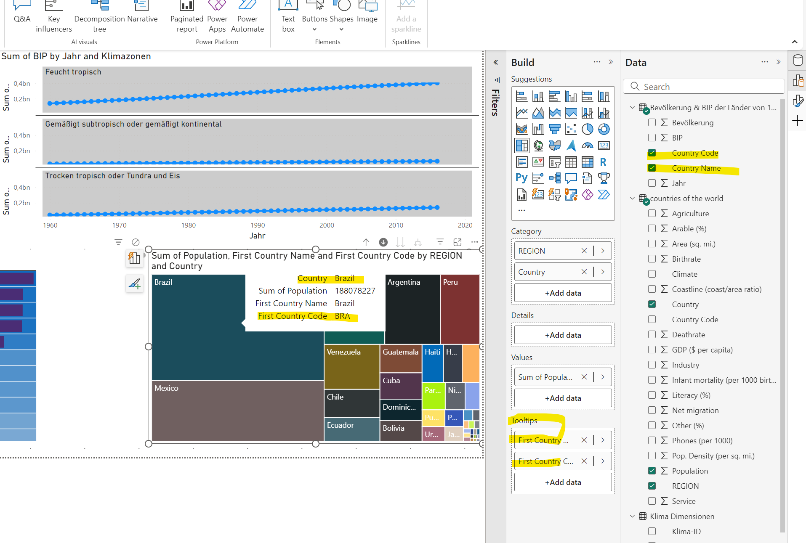
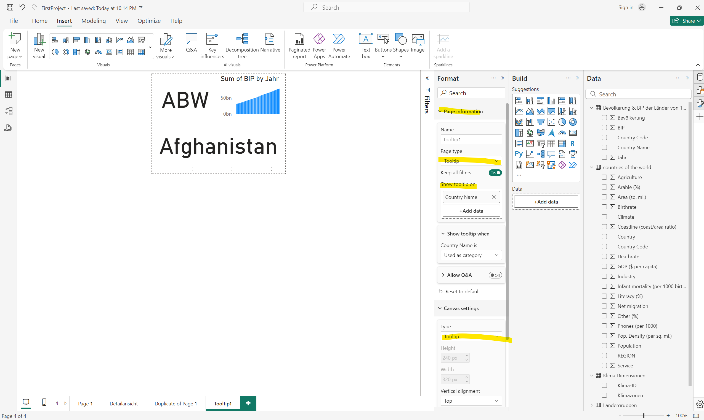

# Daten Visualisierung 2

## Quickinfos / Tooltips

- Es können auch benutzerdefinierte Tooltips angefertigt werden
- Neue Seite als Tooltip konfigurieren und Grafiken einfügen
- Zusätzlich muss noch ausgewählt werden, bei welchem Element in der Berichtsseite dieser Tooltip kommen soll

