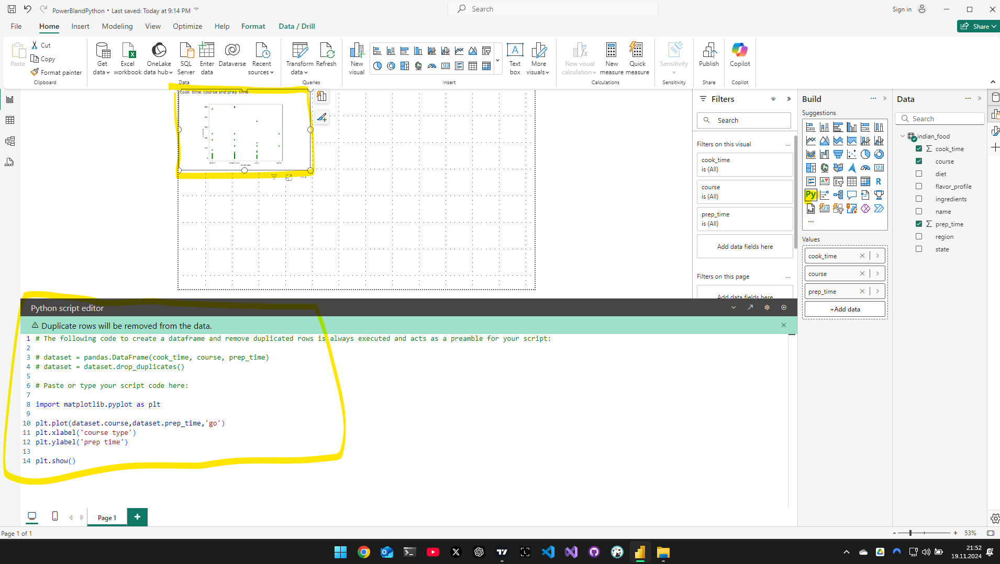

# Python in PowerBI

## Daten Transformieren mit Python

- es muss lokal auf dem Rechner Python installiert sein inkl. aller nötigen Packages
- anschließend Daten laden und ein Python script ausführen
- Dataset ist ein Pandas DF


## Daten Visualisieren mit Python

- es können alle beliebingen libs wie z.B. matplotlib oder plotly zur visualisierung verwendet werden



Violin plot:

## The following code to create a dataframe and remove duplicated rows is always executed and acts as a preamble for your script:

```python
# dataset = pandas.DataFrame(prep_time, cook_time)
# dataset = dataset.drop_duplicates()
 
# Paste or type your script code here:to import matplotlib.pylot as pltplt
import matplotlib.pyplot as plt
import seaborn as sns
 
sns.violinplot(x=dataset["course"],y=dataset["prep_time"],palette="Blues")
 
plt.show()

Pair plot:

# The following code to create a dataframe and remove duplicated rows is always executed and acts as a preamble for your script: 
 
# dataset = pandas.DataFrame(prep_time, cook_time)
# dataset = dataset.drop_duplicates()
 
# Paste or type your script code here:to import matplotlib.pylot as pltplt
import matplotlib.pyplot as plt
import seaborn as sns
 
sns.pairplot(dataset)
 
plt.show()

```

Overlapping ridge plots:

```python
import pandas as pd
import seaborn as sns
import matplotlib.pyplot as plt
import numpy as np
sns.set_theme(style="white", rc={"axes.facecolor": (0, 0, 0, 0)})
 
# Create the data
rs = dataset.prep_time
x = dataset.prep_time
g = dataset.region
df = pd.DataFrame(dict(x=x, g=g))
 
 
# Initialize the FacetGrid object
pal = sns.cubehelix_palette(10, rot=-.25, light=.7)
g = sns.FacetGrid(df, row="g", hue="g", aspect=15, height=.5, palette=pal)
 
# Draw the densities in a few steps
g.map(sns.kdeplot, "x",
      bw_adjust=.5, clip_on=False,
      fill=True, alpha=1, linewidth=1.5)
g.map(sns.kdeplot, "x", clip_on=False, color="w", lw=2, bw_adjust=.5)
g.map(plt.axhline, y=0, lw=2, clip_on=False)
 
 
# Define and use a simple function to label the plot in axes coordinates
def label(x, color, label):
    ax = plt.gca()
    ax.text(0, .2, label, fontweight="bold", color=color,
            ha="left", va="center", transform=ax.transAxes)

g.map(label, "x")


# Set the subplots to overlap


g.fig.subplots_adjust(hspace=-.25)
 
# Remove axes details that don't play well with overlap
g.set_titles("")
g.set(yticks=[])
g.despine(bottom=True, left=True)
 
plt.show()

```

- Sentiment analyse für Texte

```python
from textblob import TextBlob
from textblob.sentiments import NaiveBayesAnalyzer
def get_sentiment(text):
    #obtain polarity
    try:
        return TextBlob(text).sentiment.polarity
    except:
        return 0
dataset['Review Text'].astype(str)
dataset['Sentiment']=dataset['Review Text'].apply(get_sentiment)
```
