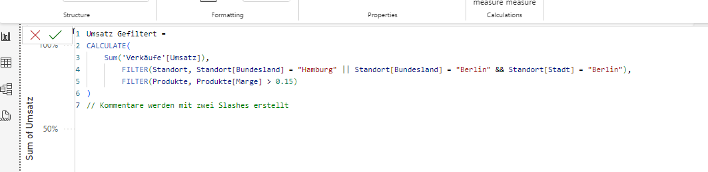

# DAX Sprache in PowerBI

- Die Doku der DAX Funktionen ist hier zu finden: [DAX DOKU](https://learn.microsoft.com/de-de/dax/calendar-function-dax)

- Der Unterschied zwischen "Berechneten Spalten" und "Measures" mit DAX ist:

    1. Eigene Logik die eine Spalte generiert wird, Spalte ist wirklich vorhanden
    2. Ein Measure ist nicht physisch als Spalte vorhanden (nur berechnet, falls Measure tatsächlich in Benutzung)
    3. Ein Measure kann performanter für den Bericht sein, da dies nur Berechnet wird, wenn es benötigt wird im Gegensatz zu einer berechneten Spalte

HideCol = IF(
    ISFILTERED(Standort[Bundesland])
)

Mechanik = IF(
    ISFILTERED(Standort[Bundesland]),
    IF(SELECTEDVALUE(Standort[Bundesland])="Hamburg" && ([Anzahl Transaktionen] > 15), "blue",
    "white"
))